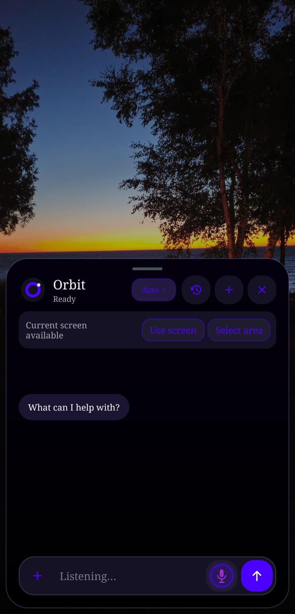
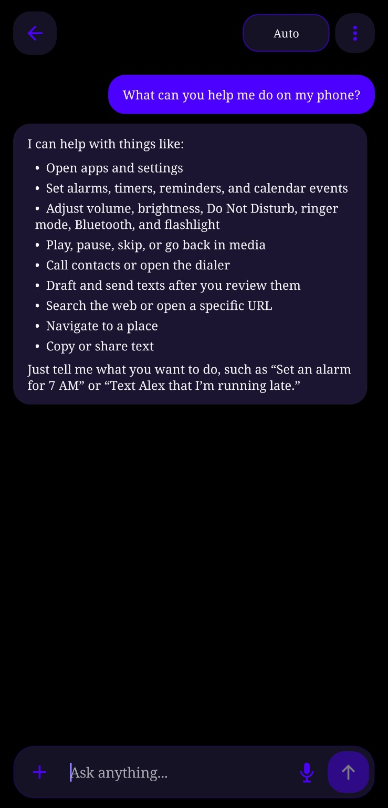
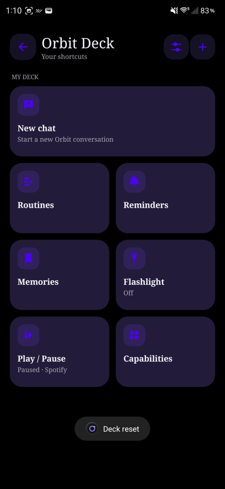
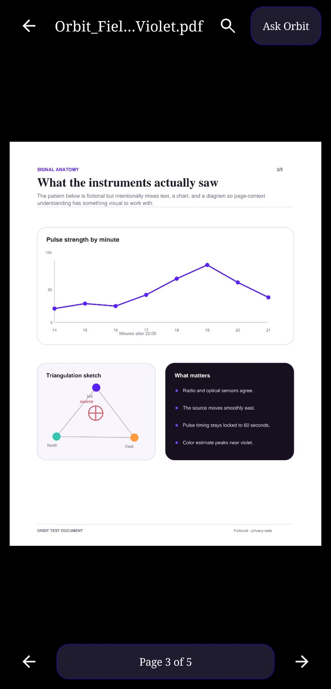
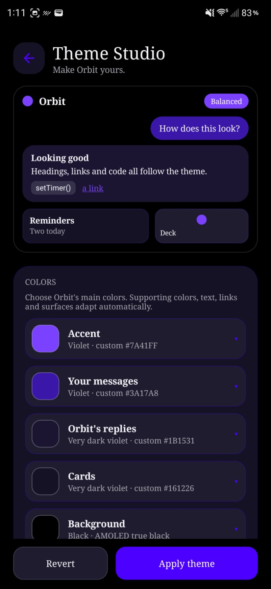

<div align="center">

# Orbit Assistant

**Your Android assistant, one gesture away, aware of the screen you choose, and ready to act.**

Orbit brings system assistant access, screen context, safe device actions, automation, and a full conversation app into one deeply customizable Android experience.

[](https://github.com/lpnovi/Orbit-Assistant/releases/latest)
[](https://github.com/lpnovi/Orbit-Assistant/releases?q=prerelease%3Atrue)

**Android 10+** · Install from GitHub · Independent project

Stable is recommended for most people. Beta offers newer features with a greater chance of bugs.

</div>

<!-- PUBLIC-LAUNCH: A short product demo or creator showcase can sit between the hero and gallery. -->

## See Orbit in action

<table>
  <tr>
    <td align="center" width="33%"><br><sub><strong>Orbit over any app</strong><br>Side-button overlay for quick help without leaving what you're doing.</sub></td>
    <td align="center" width="33%"><br><sub><strong>Full conversations</strong><br>Ask questions, work with content, and use Android actions in a persistent chat.</sub></td>
    <td align="center" width="33%"><br><sub><strong>Your command center</strong><br>Shortcuts, Routines, reminders, apps, prompts, media controls, and safe actions.</sub></td>
  </tr>
</table>

<table>
  <tr>
    <td align="center" width="50%"><br><sub><strong>Work with documents</strong><br>Read PDFs natively and ask Orbit about the current page.</sub></td>
    <td align="center" width="50%"><br><sub><strong>Make Orbit yours</strong><br>Customize Orbit's colors and presentation with a live preview. Beta feature.</sub></td>
  </tr>
</table>

## Why Orbit?

Opening a chatbot is useful. Orbit is designed for the moments when leaving what you are doing breaks the flow.

Set Orbit as Android's digital assistant and call it from the system assistant gesture or a mapped Side button. It can appear over the current app, work with screen context you allow, and hand safe actions to Android. When you want more room, the same assistant continues in a full companion chat with history, attachments, settings, and automation.

Orbit is not tied to one interaction style: type, speak, attach content, build reusable Routines, or keep selected tools one tap away in Orbit Deck.

## What Orbit can do

| | |
| --- | --- |
| **Assistant everywhere** | Invoke an overlay through Android's digital-assistant flow, continue in full chat, type or use Voice Beta, and optionally attach screen text or a screenshot. Side-button behavior depends on the phone maker and system configuration. |
| **Understand and work with content** | Attach images, files, clipboard text, and PDFs; share supported content to Orbit from other apps; read PDFs in Documents; ask about a selected page; and view rich Markdown responses. Image understanding depends on the active provider. |
| **Act on Android** | Use supported actions for timers, alarms, media, brightness, flashlight, Do Not Disturb, navigation, sharing, and more. Calendar writing uses Android's Calendar Provider and asks for confirmation before changes. Capabilities remain subject to Android permissions and device support. |
| **Make Orbit yours** | Arrange shortcuts, Routines, apps, prompts, and safe actions in Orbit Deck. Customize accents, conversation colors, fonts, AMOLED surfaces, haptics, app profiles, Memory, and other preferences. Theme Studio is currently a Beta feature. |
| **Automate repeatable work** | Build Routines with reusable steps, conditions and branches; add time or location triggers; start from templates; use Custom Commands; and launch compatible actions from Quick Settings or home-screen widgets. Declarative Extensions can add reviewed Routine actions without loading executable plugin code. |
| **Choose how Orbit thinks** | Use ChatGPT account mode for Orbit's fullest cloud feature set, install the optional Orbit Local component for private offline chat on supported hardware, or connect an advanced private HTTPS relay. OpenRouter configuration is a preview only. OpenRouter chat is not currently available. |

Advanced details are available in the [Extensions guide](docs/EXTENSIONS.md), [Orbit Local model guide](docs/LOCAL_MODELS.md), [changelog](CHANGELOG.md), and [roadmap](ROADMAP.md).

## Stable or Beta?

| Channel | Best for | What to expect |
| --- | --- | --- |
| **Stable** | Most users | Device-tested public releases and the recommended starting point. |
| **Beta** | Early adopters and testers | New features sooner, with possible rough edges or regressions. |

- **[Download Stable](https://github.com/lpnovi/Orbit-Assistant/releases/latest)** always opens GitHub's latest non-prerelease.
- **[Try the Beta](https://github.com/lpnovi/Orbit-Assistant/releases?q=prerelease%3Atrue)** searches the repository's published prereleases, so the link remains useful as new Betas replace old ones.

Orbit's in-app updater follows the channel you choose. Stable checks only normal releases. Beta considers official prereleases and newer Stable builds, then offers the eligible build with the highest Android version code. Changing channels does not weaken package, checksum, or signing verification.

## Install Orbit

Orbit is currently distributed as an APK from this GitHub repository. This is normal Android sideloading; there is no need to disable device security broadly.

1. Open **[Download Stable](https://github.com/lpnovi/Orbit-Assistant/releases/latest)**, or **[Try the Beta](https://github.com/lpnovi/Orbit-Assistant/releases?q=prerelease%3Atrue)** if you intentionally want prerelease software.
2. Under **Assets**, download `Orbit-Assistant-v*.apk`. Orbit Local is a separate optional component; it is not required for cloud-powered Orbit.
3. Open the APK from your browser or file manager.
4. If Android asks, allow that specific browser or file manager to install unknown apps, then return to the installer.
5. Review Android's installation screen, install Orbit, and complete onboarding.

Official release assets come from `lpnovi/Orbit-Assistant`, use Orbit's permanent Android signing identity, and include SHA-256 checksum files. You can compare a downloaded APK with its adjacent `.sha256` asset before installing:

```powershell
Get-FileHash -Algorithm SHA256 .\Orbit-Assistant-vX.Y.Z.apk
```

The value should match the release's `Orbit-Assistant-vX.Y.Z.apk.sha256` file exactly. Orbit's updater separately verifies the official manifest, package name, version code, APK checksum, and signing certificate before handing an approved download to Android's normal installer. It does not silently install updates.

## Your first five minutes

1. **Open Orbit and finish onboarding.** You can revisit setup later.
2. **Choose an AI provider.** ChatGPT account mode is the recommended full-featured path; Orbit Local and a private relay are optional alternatives.
3. **Choose capabilities deliberately.** Grant only the Android permissions and special access you want Orbit to use.
4. **Optional: make Orbit your digital assistant.** This enables the assistant gesture and, on supported devices, Side-button access.
5. **Try a real task.** Open an article and ask Orbit to summarize the screen, attach a PDF and ask about a page, or create a simple reminder.

## Compatibility

| Area | Current support |
| --- | --- |
| **Android version** | Android 10 (API 29) or newer. |
| **Main Orbit app** | The APK contains no native ABI-specific libraries and is designed for Android phones and responsive tablet layouts. |
| **Orbit Local** | The optional companion APK currently packages `arm64-v8a` native libraries and performs additional on-device capability checks before offering model use. |
| **Assistant invocation** | Requires Orbit to be selected as Android's digital assistant. Gesture and button mapping vary by Android version, manufacturer, launcher, and device policy. Samsung Side-button support is an important tested path, not a promise that every phone exposes the same setting. |
| **Device testing** | Stable releases are primarily validated on a Galaxy S25 Ultra. Responsive phone/tablet behavior is implemented and tested in code, but OEM-specific behavior can differ and should be reported. |

If your phone does not offer a compatible assistant-button mapping, the full Orbit app, widgets, and supported Quick Settings entry points remain available.

## Privacy and trust

Orbit exposes powerful context and device capabilities, so control is part of the product, not an afterthought.

- Screen text, screenshots, and automatic attachment behavior are configurable globally and per app. Sensitive app profiles disable automatic context, and an app can be set to never provide screen access.
- Android permissions and special access are requested for specific capabilities. You can leave capabilities disabled and manage access through Orbit or Android Settings.
- Cloud requests go to the provider you explicitly choose. Orbit Local generation stays on the device and does not silently fall back to a cloud provider.
- ChatGPT credentials, OpenRouter's setup-only key, and Extension secrets use Android Keystore-backed encryption. Credentials and Extension secrets are excluded from Orbit backups. The optional private-relay access token has a documented compatibility caveat in the detailed privacy notes.
- Orbit backups are created only through Android's file picker. They can contain personal data and are **not encrypted**, so keep them in a private location.
- The updater reads public GitHub release data and never downloads without approval or installs without Android's installer confirmation.
- Orbit Extensions are declarative data. They cannot load executable code, APKs, scripts, arbitrary intents, local files, or Orbit's personal/context data.

Read the factual [Privacy & trust notes](docs/PRIVACY.md) for the data paths, provider boundaries, backup behavior, and current limitations. This document explains product behavior; it is not a substitute for a future owner-approved legal privacy policy.

## Official downloads and release integrity

Treat only releases published at **[github.com/lpnovi/Orbit-Assistant](https://github.com/lpnovi/Orbit-Assistant/releases)** as official.

Every official release workflow verifies the tagged source version, both Orbit APK identities, the shared signing certificate, release manifest, and checksums before publication. The updater accepts only correctly labeled Stable/Beta releases with matching official assets and then lets Android perform the final installation.

Never post signing keys, account tokens, diagnostic data containing private content, or backup files in a public Issue.

## Development

| Status | Examples |
| --- | --- |
| **Shipping in Stable** | Side-button/default-assistant access, full chat, attachments, screen context, Voice Beta, Android actions, Calendar writing, Routines, Extensions, widgets, Orbit Local, Orbit Deck, and Documents. |
| **Available in Beta** | Theme Studio is currently being tested as part of the `0.7.8.3` Beta line. |
| **Planned or under consideration** | Orbit Vault / Quick Capture, Hybrid Auto routing, deeper local capabilities, and other work listed in the roadmap. OpenRouter chat remains deferred until it can be properly validated. |

See [ROADMAP.md](ROADMAP.md) for the detailed development record and future direction, or [CHANGELOG.md](CHANGELOG.md) for shipped release history. Roadmap items are direction, not promised dates.

Orbit is an independent project developed with substantial help from AI coding tools. Changes are reviewed in the repository, exercised through the project's test process, and validated on real devices before Stable promotion. No AI provider, model company, or device manufacturer owns, sponsors, endorses, or officially supports Orbit.

Want to inspect a local debug build? Start with [Building from source](docs/BUILDING.md). Official signing material is intentionally not part of the repository.

## Support and feedback

- **Found a bug or unexpected behavior?** [Open a bug report](https://github.com/lpnovi/Orbit-Assistant/issues/new?template=bug_report.yml).
- **Have an idea?** [Open a feature request](https://github.com/lpnovi/Orbit-Assistant/issues/new?template=feature_request.yml).
- **Need to compare releases?** Read the [changelog](CHANGELOG.md) and [GitHub Releases](https://github.com/lpnovi/Orbit-Assistant/releases).

GitHub Issues are public. Remove screenshots, notifications, account details, screen content, tokens, and other personal data before posting.

## Contributing

A public contribution policy has not been published yet. If you want to propose a code or documentation change, open an Issue first so scope and expectations can be discussed before a pull request.

## License

Orbit Assistant is licensed under the [Mozilla Public License 2.0](LICENSE).

Product and service names belong to their respective owners. Orbit Assistant is not an official ChatGPT, OpenAI, Samsung, Google, or Android application.
